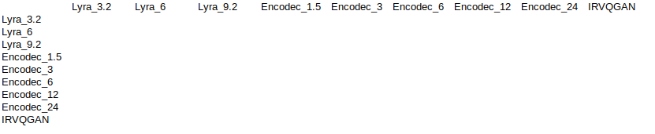

# Unmasking Neural Codecs: Forensic Identification of AI-compressed Speech
This repository contains the code for the paper 
**Denise Moussa, Sandra Bergmann, Christian Riess. Unmasking Neural Codecs: Forensic Identification of AI-compressed Speech**.
accepted at  [Interspeech 2024](https://interspeech2024.org/). The paper is available [here](https://faui1-files.cs.fau.de/public/publications/mmsec/2024-Moussa-Interspeech.pdf).
If you use this repository for your research, please cite our work. 


## Prerequisites
- `Python 3.8`
- The python packages needed to run the scripts are defined in `requirements.txt`

## Datasets
Download the [training and test data](https://faui1-files.cs.fau.de/public/mmsec/datasets/interspeech24_neural_codec_data/)  into the `data` folder or custom storage location. Adapt the paths in the configuration files (`configs/`) if necessary (see **Configuration Files**). The data includes uncompressed and ai-compressed versions of LibriSpeech and TSP samples. Structure:
```angular2html
.
|-- ai_compressed_data
    |-- librispeech
    |   |-- encodec
    |   |-- irvqgan
    |   `-- lyra
    |-- librispeech_test
    |   |-- encodec
    |   |-- irvqgan
    |   `-- lyra
    |-- tsp
    |   |-- encodec
    |   |-- irvqgan
    |   `-- lyra
    `-- tsp_test
        |-- encodec
        |-- irvqgan
        `-- lyra

`-- uncompressed_data
    |-- librispeech_partial_2s_24kHz
    |-- librispeech_partial_test_2s_24kHz
    |-- tsp_partial_2s_24kHz
    `-- tsp_partial_test_2s_24kHz

```
## Configuration Files
The folder `configs` contains the configuration files for running the experiments. A config file primarily controls the choice of the training and test datasets.

- `configs/binary`: Configs for experiments on intra-codec and cross-codec detection on LibriSpeech and TSP data (c.f. paper Sec. 4.1 and Sec. 4.2)
- `configs/n_class` Configs for experiments on identifying individual neural codecs on LibriSpeech and TSP data (c.f. paper Sec. 4.3)

Change the data path specifications in the config files if needed. The options in the config files are set to reproduce the results in the paper.
See the comments in `configs/binary/libri_libri/encodec.py` and `configs/n_class/n_class_config_libri_libri.py` for further explanations.
## Classifier Training and Prediction
The repository contains two scripts for classifier training and evaluation. 
To reproduce the results for binary intra-codec and cross-codec detection (c.f. paper Sec. 4.1 and Sec. 4.2), run
```bash
$ python binary_classification.py
```
To reproduce the results for neural codec identification (c.f. paper Sec. 4.3), run
```bash
$ python n_class_classification.py
```
Results will be written to `OUTPUT_DIR` as `.csv` files.

Notes: Adapt the variable `CONFIGS` in both files to run the experiments for only specific dataset combinations. Adapt the variable `OUTPUT_DIR` to change the location where classifier results are stored.


### Robustness Tests
The impact of signal degradation on test data is discussed in the paper in Sec. 4.3.2. To control post-processing operations, i.e., noise, resampling or compression with traditional formats, set the options in the config files accordingly. Those are:
```python
# degradations (degradations are evaluated one at a time in the paper. Adjust the order of degradation application in
# data_loading.prepair_data_fft to your requirements to test several degradations at once)
noise_snr_test = None
compr_test = (None, None)  # <(format, bitrate)>
resampling_sr_test = None

```
### Nicely Formatted Results
The `.csv` output of `binary_classification.py` contains many rows when run for all dataset, neural codecs and bitrate combinations. 
The script `utils/create_tables_from_csv.py` takes a result `.csv` file as input, creates empty table templates for every possible training/test set combination and fills in the results that are available from the `.csv` file. Usage:
```bash
$ python utils/create_tables_from_csv.py path/to/input/csv/file
```
Table template:
